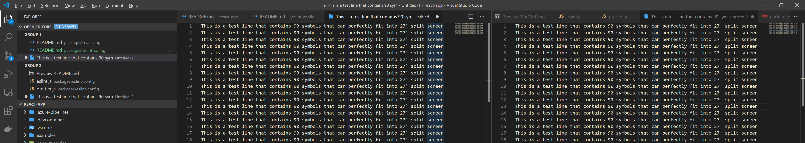

# @mocoding/eslint-config

> Shared eslint and prettier configuration

This package is a part of [@mocoding/react-app](https://www.npmjs.com/package/@mocoding/react-app) library. It contains shared [eslint](https://eslint.org/) and [prettier](https://prettier.io/) settings configured to work together for [Typescript](https://www.typescriptlang.org/) and [React](https://reactjs.org/).

## Getting started

Install package as development dependency:

```sh
yarn add --dev @mocoding/eslint-config
```

Add the following to lines to `package.json` file:
```json
  "eslintConfig": {
    "extends": "@mocoding/eslint-config"
  },
  "prettier": "@mocoding/eslint-config/prettier"
```

## Details

Several important notes:
1. Width is set to 90 as I found it anough to fit into 27' monitor with split screen, files browser and map. It works for me. It may work for you but it will not work for everybody.

2. `react/prop-types` is disabled. It does not required for Typescript
3. `@typescript-eslint/explicit-function-return-type` changed to `warn` and `allowExpressions` is set to true.


